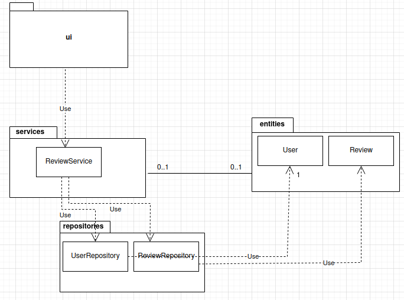
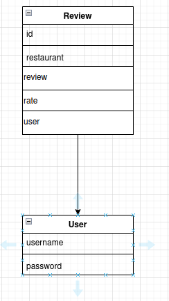
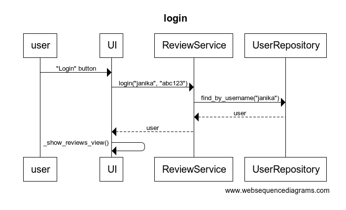
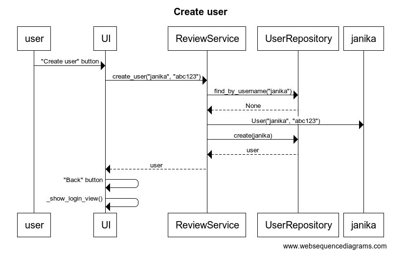
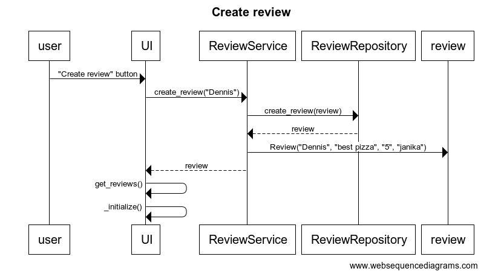

# Arkkitehtuurikuvaus

## Sovelluksen rakenne

Ohjelman osien suhdetta kuvaava pakkauskaavio:

Pakkaus *ui* sisältää käyttöliittymästä, *services* sovelluslogiikasta ja *repositories* tietojen pysyväistallennuksesta vastaavat tiedostot. Pakkaus *entities* sisältää luokat *User* ja *Review*, jotka kuvastavat sovelluksen käyttämiä tietokohteita.

## Sovelluslogiikka

Ohjelman tietomallin muodostavat [User](https://github.com/janikakalliokoski/ot-harjoitustyo/blob/master/src/entities/user.py) ja [Review](https://github.com/janikakalliokoski/ot-harjoitustyo/blob/master/src/entities/review.py) luokat, ja ne kuvaavat sovellukseen luotuja käyttäjiä ja niiden tekemiä arvioita ravintoloista.

Toiminnallisista kokonaisuuksista vastaa [ReviewService](https://github.com/janikakalliokoski/ot-harjoitustyo/blob/master/src/services/service.py)-luokan olio ReviewService. Luokassa on jokaiselle käyttöliittymän toiminnolle oma metodi, kuten `login(username, password)`, `create_user(username, password, login=True)`, `find_reviews_by_user(user)` ja `create_review(review)`. 

_ReviewService_-luokka pääsee _repositories_ pakkauksessa sijaitsevien luokkien [UserRepository](https://github.com/janikakalliokoski/ot-harjoitustyo/blob/master/src/repositories/user_repository.py) ja [ReviewRepository](https://github.com/janikakalliokoski/ot-harjoitustyo/blob/master/src/repositories/review_repository.py) avulla käsiksi käyttäjiin ja arvioihin liittyviin tietoihin. 

## Käyttöliittymä

Käyttöliittymä sisältää neljä erillistä näkymää:
- kirjautuminen
- uuden käyttäjän luonti
- lista arvosteluista
- uuden arvostelun luonti

Nämä kaikki on toteutettu omana luokkanaan, ja vain yksi näkymistä on kerrallaan auki. Näkymien välillä vaihtamisesta vastaa [UI](https://github.com/janikakalliokoski/ot-harjoitustyo/blob/master/src/ui/ui.py)-luokka. Käyttöliittymä on eriytetty sovelluslogiikasta, ja se kutsuu [ReviewService](https://github.com/janikakalliokoski/ot-harjoitustyo/blob/master/src/services/service.py)-luokan metodeja.

## Tietojen pysyväistallennus

Kansion *repositories* luokka UserRepository huolehtii käyttäjiin liittyvien tietojen tallettamisesta, ja tallettaa ne SQLite-tietokantaan. Kansion *repositories* luokka ReviewRepository huolehtii arvosteluihin liittyvien tietojen tallettamisesta, ja tallettaa ne myöskin SQLite-tietokantaan.

### Tietokannat

Käyttäjät tallennetaan SQLite-tietokantaan users, joka alustetaan [initialize_database.py](https://github.com/janikakalliokoski/ot-harjoitustyo/blob/master/src/initialize_database.py)-tiedostossa. Samoin käyttäjien tekemät arviot tallennetaan SQLite-tietokantaan, reviews, joka alustetaan samassa [initialize_database.py](https://github.com/janikakalliokoski/ot-harjoitustyo/blob/master/src/initialize_database.py)-tiedostossa.

## Päätoiminnallisuudet

### Sekvenssikaavio käyttäjän sisäänkirjautumisesta:

Kirjautumisnäkymässä kenttiin kirjoitetaan tunnus ja salasana, ja klikataan "Login" painiketta, ja [tapahtumankäsittelijä](https://github.com/janikakalliokoski/ot-harjoitustyo/blob/master/src/ui/login.py#L16) kutsuu sovelluslogiikan ReviewService:n metodin [login](https://github.com/janikakalliokoski/ot-harjoitustyo/blob/master/src/services/service.py#L36) avulla, onko käyttäjätunnusta olemassa, ja jos on, niin täsmääkö salasana. Jos tunnus ja salasana täsmäävät, kirjautuminen onnistuu ja käyttöliittymä vaihtaa näkymäksi ReviewsView:n.

### Sekvenssikaavio käyttäjän luomisesta:

Kun käyttäjän luomisnäkymässä on syötetty käyttäjätunnus, joka ei ole vielä käytössä, sekä salasana, jonka jälkeen klikataan painiketta "Create", kutsuu [tapahtumankäsittelijä](https://github.com/janikakalliokoski/ot-harjoitustyo/blob/master/src/ui/create_user.py#L51) metodia [create_user](https://github.com/janikakalliokoski/ot-harjoitustyo/blob/master/src/services/service.py#L81) antaen parametreiksi luotavan käyttäjän tiedot. Sovelluslogiikka selvittää [UserRepository](https://github.com/janikakalliokoski/ot-harjoitustyo/blob/master/src/repositories/user_repository.py):n avulla, onko käyttäjätunnus jo olemassa. Jos ei, luo sovellus User-olion ja tallentaa sen kutsumalla [UserRepository](https://github.com/janikakalliokoski/ot-harjoitustyo/blob/master/src/repositories/user_repository.py):n metodia [create_user](https://github.com/janikakalliokoski/ot-harjoitustyo/blob/master/src/repositories/user_repository.py#L22). Tämän jälkeen käyttäjä saa ilmoituksen, kun käyttäjä on luotu onnistuneesti ja voi palata kirjautumisnäkymään painamalla painiketta "Back" ja siitä edelleen kirjautua sisään.

### Sekvenssikaavio arvion luomisesta:

Kun arvion luomisnäkymässä on syötetty ravintolan nimi, kirjallinen arvio, numero arvio ja käyttäjä virheettömästi, klikataan painiketta "Ok", kutsuu [tapahtumankäsittelijä](https://github.com/janikakalliokoski/ot-harjoitustyo/blob/master/src/ui/create_review.py#L62) metodia [create_review](https://github.com/janikakalliokoski/ot-harjoitustyo/blob/master/src/services/service.py#L148) antaen parametreiksi luotavan arvion tiedot. Jos tiedot ovat virheettömiä, sovellus luo Review-olion ja tallentaa sen tietokantaan kutsumalla [ReviewRepository](https://github.com/janikakalliokoski/ot-harjoitustyo/blob/master/src/repositories/review_repository.py):n metodia [create_review](https://github.com/janikakalliokoski/ot-harjoitustyo/blob/master/src/repositories/review_repository.py#L27). Tämän jälkeen käyttäjä saa ilmoituksen, kun arvio on luotu onnistuneesti ja voi palata takaisin arvioita listaavaan näkymään painamalla painiketta "Back" ja siitä edelleen kirjautua ulos.

### Muut toiminnallisuudet:
Sama periaate toistuu muissakin sovelluksen toiminnallisuuksissa. Tapahtumankäsittelijä kutsuu sopivaa metodia sovelluslogiikasta, ja sovelluslogiikka päivittää arvioiden tai kirjautuneen käyttäjän tilaa. Kun kontrolli palaa käyttöliittymään, päivitetään lista arvioista, jos niin on tarpeen.
