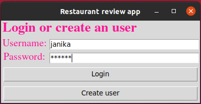
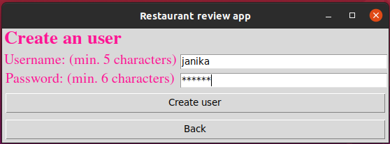
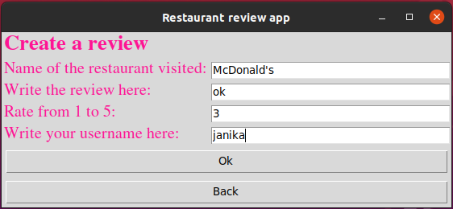

### Käyttöohje
Lataa projektin viimeisimmän [releasen](https://github.com/janikakalliokoski/ot-harjoitustyo/releases/tag/viikko5) lähdekoodi valitsemalla *Assets*-osion alta *Source code*. Python version on oltava vähintään 3.8.12., jotta sovelluksen voi käynnistää.

## Ohjelman käynnistäminen
1. Asenna riippuvuudet komennolla:
```bash
poetry install
```
2. Suorita alustustoimenpiteet komennolla:
```bash
poetry run invoke build
```
3. Nyt ohjelman voi käynnistää komennolla:
```bash
poetry run invoke start
```

## Kirjautuminen
Sovellus käynnistyy kirjautumisnäkymään:



Jos on tehnyt sovellukseen käyttäjän, voi tunnuksen ja salasanan kirjoittaa niille tarkoitettuihin kenttiin. Jos tunnus vielä puuttuu, sen voi luoda painamalla nappia "Create user", josta siirrytään käyttäjän luomisnäkymään.

## Uuden käyttäjän luominen
Kirjautumisnäkymästä voi siirtyä käyttäjän luomisnäkymään painamalla painiketta "Create user".



Käyttäjä luodaan valitsemalla mieleinen käyttäjätunnus, jossa on vähintään 5 merkkiä, sekä salasana, jossa on vähintään 6 merkkiä. Jos käyttäjätunnus ei ole varattu, voidaan käyttäjä luoda painamalla painiketta "Create user". Jos luonti onnistuu, saa käyttäjä tästä ilmoituksen. Jos käyttäjätunnus on varattu, liian lyhyt tai sisältää tyhjiä merkkejä, saa käyttäjä tästä virheilmoituksen. Käyttäjä saa myös virheilmoituksen, jos salasana on liian lyhyt tai sisältää tyhjiä merkkejä. Kirjautumisnäkymään siirrytään painamalla painiketta "Back" ja tästä edelleen sisään sovellukseen.
## Arvosteluiden lista
Sisäänkirjautumisen jälkeen siirrytään käyttäjän luomien arvosteluiden listaavaan näkymään:


Näkymästä voi kirjautua ulos painamalla painiketta "Log out", joka vie takaisin kirjautumisnäkymään. 
Painamalla painiketta "Create review" siirrytään näkymään, jossa voidaan luoda arvostelu ravintolasta.
## Arvosteluiden luonti


Ravintolan nimi, arvostelu kirjallisena, numero-arvosana ja käyttäjätunnus kirjoitetaan niille tarkoitettuihin kenttiin ja painetaan "Ok"-painiketta. Jos jokin kenttä on jäänyt tyhjäksi, numero ei ole välillä 1-5 tai käyttäjätunnus ei täsmää kirjautuneeseen käyttäjään, saa käyttäjä tästä ilmoituksen. Käyttäjä saa myös virheilmoituksen silloin, jos jokin kenttä sisältää tyhjiä merkkejä. Jos arvostelu luodaan onnistuneesti, saa käyttäjä tästä ilmoituksen ja arvostelu ilmestyy arvosteluita listaavaan näkymään.
Painamalla painiketta "Back" pääsee takaisin listaan arvosteluista.
