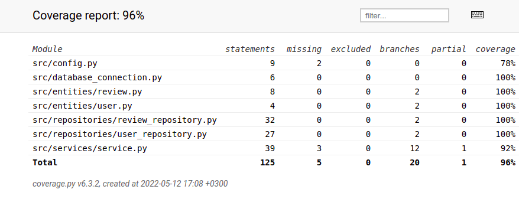

# Testausdokumentti

Ohjelmaa on testattu automaattisilla unittest yksikkö- ja integraatiotesteillä ja manuaalisesti järjestelmätason testeillä.

## Yksikkö- ja integraatiotestaus

### Repositorio-luokat

Repository-luokkia `ReviewRepository` ja `UserRepository` on testattu vain testitietokannoilla, joiden nimet on konfiguroitu _.env.test_-tiedostoon. `ReviewRepository` luokkaa testataan [TestReviewRepository](https://github.com/janikakalliokoski/ot-harjoitustyo/blob/master/src/tests/test_repositories/test_reviews.py)-testiluokalla ja `UserRepository`-luokkaa testataan [TestUserRepository](https://github.com/janikakalliokoski/ot-harjoitustyo/blob/master/src/tests/test_repositories/test_users.py)-testiluokalla.

### Sovelluslogiikka

Sovelluksen logiikasta vastaavaa `ReviewService`-luokkaa testataan [ReviewService](https://github.com/janikakalliokoski/ot-harjoitustyo/blob/master/src/tests/test_services/test_service.py#L63)-testiluokassa. `ReviewService`-olio on alustettu siten, että sille on injektoitu riippuvuuksiksi repositorio-oliot `FakeUserRepository` ja `FakeReviewRepository`, jotka tallentavat tietoa muistiin pysyväistallennuksen sijaan. 

### Testikattavuus

Käyttöliittymäkerros pois jättäen ohjelman testauksen haarautumakattavuus on 95%

Testaamatta jäi mm. tilanne, jossa arvostelussa ravintolan nimi tai kirjallinen arvio sisältää välilyöntejä ja tilanne, jossa arvostelun luoja kirjoittaa väärän käyttäjänimen sille varattuun kenttään.

## Järjestelmätestaus

Ohjelman järjestelmätestaus on suoritettu manuaalisesti.

### Asennus ja konfigurointi

Sovellus on haettu ja sitä on testattu [käyttöohjeen](https://github.com/janikakalliokoski/ot-harjoitustyo/blob/master/dokumentaatio/kayttoohje.md) kuvaamalla tavalla Linux-ympäristössä. Testauksessa on käytetty eri konfiguraatioita _.env_-tiedoston kautta.

### Toiminnallisuudet

Kaikki käyttöohjeessa sekä [määrittelydokumentissa](https://github.com/janikakalliokoski/ot-harjoitustyo/blob/master/dokumentaatio/vaatimusmaarittely.md) olevat toiminnallisuudet on käyty läpi. Syötekentät kaikkien toiminnallisuuksien yhteydessä on yritetty täyttää virheellisillä syötteillä, kuten tyhjillä merkeillä tai väärä käyttäjätunnus arviota luodessa.

## Laatuongelmat

Sovellus ei anna järkevää virheilmoitusta, jos SQLite tietokanta on jäänyt alustamatta `python -m poetry run invoke build` komennolla. Myöskään konfiguraation määrittelemiin tiedostoihin ei ole luku- tai kirjoitusoikeutta.
